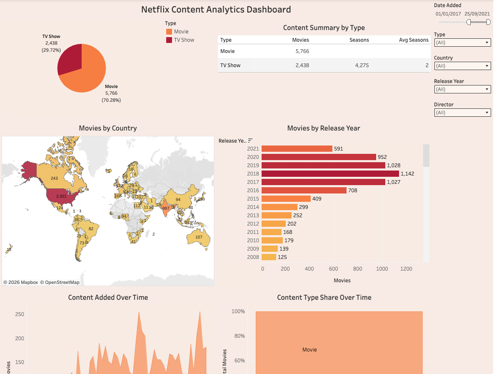

# Netflix Content Analytics Dashboard
Tableau dashboard analyzing Netflix content distribution, release trends, and content growth across countries and genres.

## Dashboard Preview

## Business Task
Analyze Netflix content data to understand the distribution of movies and TV shows, global content production, and trends in content releases over time.

## Tools
Tableau, Data Visualization, Dashboard Design, KPI Analysis 

## Key Insights
- Movies represent the majority of Netflix content compared to TV shows.
- The United States produces the largest number of movies.
- The number of titles added to Netflix increased significantly after 2016.
- Drama and comedy are among the most common genres.
  
## Interactive Dashboard
[View the interactive dashboard on Tableau Public](https://public.tableau.com/views/NetflixContentAnalyticsDashboard_17727540187190/Netflix?:language=en-GB&:sid=&:redirect=auth&:display_count=n&:origin=viz_share_link)
